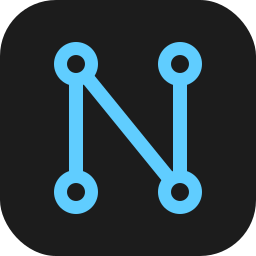
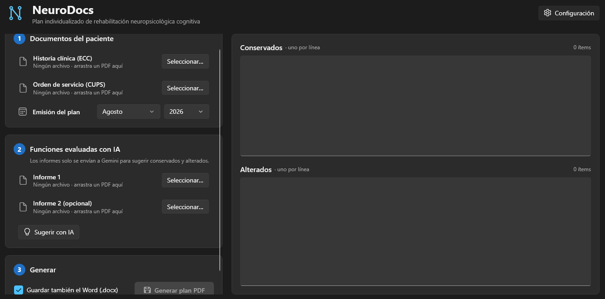
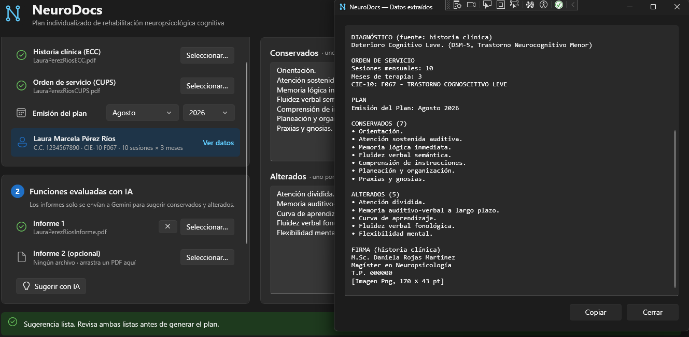
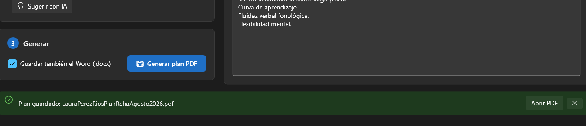

# NeuroDocs


Aplicación de escritorio para automatizar la elaboración de planes de rehabilitación neuropsicológica cognitiva.

A partir de la historia clínica (ECC) y la solicitud de orden de servicio (CUPS) en PDF, NeuroDocs extrae los datos del paciente, el diagnóstico, el código CIE-10 y la duración de la terapia; incorpora la firma del profesional; propone la clasificación de funciones conservadas y alteradas con Gemini a partir de los informes de las pruebas, y genera el plan final en PDF desde la plantilla institucional.

## Requisitos

- Windows 10/11
- [.NET 10 SDK](https://dotnet.microsoft.com/download)
- Microsoft Word (se usa para exportar el plan a PDF)
- Clave de API de Gemini ([Google AI Studio](https://aistudio.google.com))

## Configuración

| Variable de entorno | Descripción | Obligatoria |
|---|---|---|
| `GEMINI_API_KEY` | Clave de la API de Gemini | Sí, para usar la IA |
| `GEMINI_MODEL` | Modelo a usar (por defecto `gemini-3.8-flash`) | No |

```
setx GEMINI_API_KEY "tu_clave"
```

Las instrucciones que recibe Gemini están en `src/NeuroDocs/IA/InstruccionesFunciones.txt` y se pueden ajustar sin recompilar.

## Estructura

```
src/NeuroDocs/
├── Models/      Modelos de datos (paciente, orden, firma, plan)
├── Services/    Extracción de PDF, parsers, generación Word/PDF, cliente de Gemini
├── Plantillas/  Plantilla Word del plan
└── IA/          Instrucciones para Gemini
```

## Uso

1. Seleccionar la historia clínica (ECC) y la orden de servicio (CUPS), y pulsar **Leer documentos**.
2. Elegir el mes de emisión del plan.
3. Cargar uno o dos informes de pruebas y pulsar **Sugerir con IA**, o escribir las funciones manualmente. Revisar siempre el resultado antes de generar.
4. Pulsar **Generar plan (PDF)**.

## Privacidad

Este repositorio no debe contener documentos de pacientes. El `.gitignore` excluye PDFs y documentos Word (salvo la plantilla);

## Capturas

**Pantalla principal:** documentos del paciente, funciones sugeridas por la IA y generación del plan.



**Datos extraídos:** vista previa de la información leída de la historia clínica, la orden de servicio y la sugerencia generada por la IA.



**Plan generado:** documento final en PDF con los datos, las funciones evaluadas y la firma del profesional.



